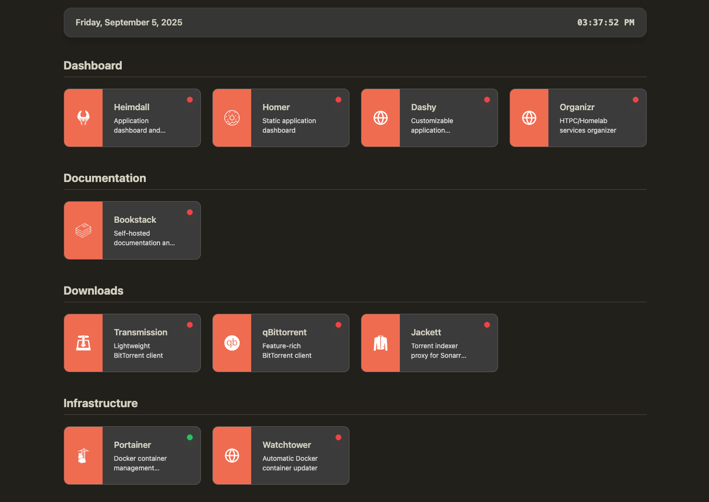

# Lander

A very minimal, lightweight responsive dashboard for your homelab, or anywhere else really. Lander is essentially a page with a few links that can be customized in different ways, with various themes. That's all it is. It doesn't have deep integrations with any self-hosted services. It can show them, it can ping them, and it can visually tell you if they can't be pinged—that's all. 



## Why Another Dashboard?

I'm a big fan of self-hosted dashboard projects like Homepage, Homer, and Heimdall. I love them and have used them in the past. But they have a few too many integrations in some cases, or too many restrictions on what I can achieve with them. It's not the same for everyone, but I believe I'm not the only one who has faced that issue. So I made something the way I wanted it, and it might also be what you're looking for. See the roadmap section to see what I have planned for the future. 

## Features

- **Clean, Modern Interface**: Responsive design that works on desktop and mobile
- **Multiple Themes**: Choose from various color schemes including dark and light modes
- **Flexible Display Modes**: Default cards, compact view, or icon-only layouts
- **Icon Integration**: Automatic icons from [selfhst/icons](https://github.com/selfhst/icons) with Lucide fallbacks
- **YAML Configuration**: Simple, human-readable configuration files
- **Docker Ready**: Easy deployment with volume mounting for configurations
- **Health Monitoring**: Built-in service status indicators

## Quick Start

### Docker Run

```bash
# Create a config directory
mkdir -p ./lander_config

# Run Lander
docker run -d \
  --name lander \
  -p 3000:3000 \
  -v ./lander_config:/app/dist/config \
  ghcr.io/oritromax/lander:latest
```

### Docker Compose

Create a `docker-compose.yml` file:

```yaml
services:
  lander:
    image: ghcr.io/oritromax/lander:latest
    container_name: lander
    ports:
      - "3000:3000"
    volumes:
      - ./lander_config:/app/dist/config
    environment:
      - NODE_ENV=production
      - PORT=3000
    restart: unless-stopped
    healthcheck:
      test: ["CMD", "wget", "--no-verbose", "--tries=1", "--spider", "http://localhost:3000"]
      interval: 30s
      timeout: 3s
      retries: 3
      start_period: 10s
```

Then run:

```bash
docker-compose up -d
```

## Configuration

Lander uses YAML files for configuration. On first run, default configuration files will be created in your mounted volume.

### Directory Structure

```
lander_config/
├── config.yaml       # Main dashboard settings
└── services.yaml     # Your services and applications
```

### Main Configuration (`config.yaml`)

```yaml
# Theme Configuration
# Options: "default", "forest", "nether", "summer", or "neon"
theme: "neon"

# Card Display Configuration
# Options: "default", "compact", or "icon"
# default: Full cards with icon, title, description, and status indicator
# compact: Medium cards with icon, title, and status indicator (no description)
# icon: Minimal cards showing only icon and status indicator (fits more on screen)
card-display: "compact"

# Icon Size Configuration
# Options: "default" or "full"
# default: Normal sized icons with padding/borders
# full: Icons extend full height and to left edge of card for prominent display
icon-size: "full"

# View Configuration
# Options: "grid" or "category"
# grid: Shows all services in a grid with category filter at the top
# category: Groups services by category with headings, no filter needed
view: "category"

# Order Configuration
# Options: "ascending" or "descending"
# grid: Controls the order of all services
# category: Controls the order of categories (not individual services)
order: "ascending"
```

**Configuration Options:**
- `theme`: Available themes: `default`, `forest`, `nether`, `summer`, `neon`
- `card-display`: Card size: `default`, `compact`, `icon`
- `icon-size`: Icon display: `default`, `full`
- `view`: Layout: `grid`, `category`
- `order`: Sorting: `ascending`, `descending`

### Services Configuration (`services.yaml`)

```yaml
services:
  - name: "Portainer"
    description: "Docker container management interface"
    url: "https://portainer.example.com"
    icon: "portainer"
    category: "Infrastructure"
    
  - name: "Plex"
    description: "Media server and streaming platform"
    url: "https://plex.example.com"
    icon: "plex"
    category: "Media"
    
  - name: "Nextcloud"
    description: "Personal cloud storage and collaboration"
    url: "https://nextcloud.example.com"
    icon: "nextcloud"
    category: "Storage"
```

**Service Properties:**
- `name`: Service name for display
- `description`: Brief service description
- `url`: Service URL
- `icon`: Icon identifier (from selfhst/icons)
- `category`: Category for grouping services

### Available Themes

Lander includes 5 built-in themes:

- **default**: Clean blue and gray color scheme
- **forest**: Warm earthy color palette with bone, tomato, and onyx colors  
- **nether**: Bold contrast theme with deep reds, blues, and cream tones, inspired by Minecraft 
- **summer**: Soft, natural palette with warm greens, beiges, and creamy tones
- **neon**: Electric cyberpunk theme with bright pinks, turquoise, and neon accents

## Development

### Prerequisites

- Node.js 18+
- npm or yarn

### Setup

```bash
# Clone the repository
git clone https://github.com/oritromax/lander.git
cd lander

# Install dependencies
npm install

# Start development server
npm run dev
```

### Available Scripts

- `npm run dev` - Start development server with config setup
- `npm run build` - Build for production
- `npm run lint` - Run ESLint
- `npm run preview` - Preview production build

### Building Docker Image

```bash
# Build the image
docker build -t lander:local .

# Run locally built image
docker run -d -p 3000:3000 -v ./lander_config:/app/dist/config lander:local
```

## Contributing

We welcome contributions! Here's how you can help:

### Reporting Issues

1. Check existing issues to avoid duplicates
2. Use the issue template when creating new issues
3. Include relevant details: browser, Docker version, configuration

### Pull Requests

1. Fork the repository
2. Create a feature branch: `git checkout -b feature/amazing-feature`
3. Make your changes
4. Run tests and linting: `npm run lint`
5. Commit your changes: `git commit -m 'Add amazing feature'`
6. Push to your branch: `git push origin feature/amazing-feature`
7. Open a Pull Request

### Development Guidelines

- Follow the existing code style
- Add appropriate TypeScript types
- Test your changes thoroughly
- Update documentation as needed
- Keep commits focused and descriptive

### Adding New Themes

1. Create a new CSS file in `src/styles/themes/`
2. Add your theme following the existing structure
3. Test with different display modes
4. Submit a PR with screenshots

### Adding New Features

- Discuss major changes in an issue first
- Ensure backward compatibility with existing configs
- Add appropriate error handling
- Document new configuration options

## Roadmap

- [ ] Weather widget
- [ ] Hot-reloading configurations
- [ ] Offline icon pack
- [ ] No-icon configuration
- [ ] Ping using Docker internal network
- [ ] Environment variable overrides
- [ ] Custom CSS injection
- [ ] Multi-language support 

## Support

- **Documentation**: Check this README and inline code comments
- **Issues**: [GitHub Issues](https://github.com/oritromax/lander/issues)


## License

This project is licensed under the MIT License. See the [LICENSE](LICENSE) file for details.

## Acknowledgments

- Icons provided by [selfhst/icons](https://github.com/selfhst/icons)
- Fallback icons from [Lucide React](https://lucide.dev)
- Inspired by [Homepage](https://github.com/gethomepage/homepage)

---

**Made with ❤️ for the self-hosting community**